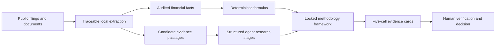

# CleanTech Finance

> New: the local SQLite enterprise assessment and triage integration MVP is documented in
> [docs/enterprise-assessment-system.md](docs/enterprise-assessment-system.md). It keeps NEX
> RAG as a citation sidecar, applies deterministic course/policy matching, and requires a
> human `draft → pending_review → approved/rejected` decision.

Evidence-first financial and bankability research for clean energy companies.

[](pyproject.toml)
[](pyproject.toml)
[](tests)
[](LICENSE)

> **Explore the product story:** [GitHub showcase](SHOWCASE.md) · [中文说明](README.zh-CN.md) · [current project status](docs/project-status-validation-receipt-2026-07-18.md)

`cleantech-finance` turns annual reports and cited public comparators into fixed, five-cell financial evidence cards. It extracts a conservative set of audited facts, calculates reproducible metrics, applies a locked maintainer-authored framework, and exposes every unresolved judgment in a human review queue.

It does **not** produce an investment recommendation or an automated technology-readiness score.

## Why this exists

Generic research agents can summarize a company but often blur facts, calculations, and inference. Financial screeners calculate ratios but rarely explain whether a clean energy product can be manufactured, financed, permitted, insured, and adopted at the scale assumed by the model.

This project connects the two:



The deterministic core runs offline after documents are downloaded: zero model calls, zero API keys, and zero document uploads. The optional Agent Skill may research and prepare cited `judgment_context`; the local core imports, validates, calculates, and renders those stage outputs. A zero in `model_calls` describes the core run, not the preceding agent research.

See [the landscape review](docs/landscape.md) for the adjacent open-source projects considered and the gap this repository targets.

## What v0.3 actually delivers

Two dimensions are validated end to end:

- Profitability and unit economics
- Cash flow and funding gap

Each dimension produces one fixed card with exactly five cells:

1. cited subindustry and value-chain position;
2. extracted facts and deterministic calculations, each labeled and cited;
3. a locked, open-source-neutral methodology framework with an explicit comparison basis;
4. a locally computed red/amber/green **evidence signal**, with rule ID,
   version, exact subindustry scope, inputs, and digests;
5. evidence gaps, required human judgment, and verification items.

The signal is never detached from its basis and gaps. There is no numeric score, weighted total, investment rating, credit rating, or aggregate risk rating.

In v0.3, the Agent Skill prepares cited semantic inputs but cannot supply or
override a signal, rule, path, or rationale. The deterministic core is the only
signal authority. Formal cards present all five cell headings, locked framework,
rule explanation, review gaps, and disclaimer in English and Chinese. Numeric
facts, page locators, source titles, and links stay in their original form.

## Honest capability inventory

Six financial retrieval lenses exist, but only the two listed above are
validated and have implemented five-cell cards. The other four have explicitly
scoped, authored **input-contract blueprints** only; authored does not mean
validated, executable, or complete:

- Revenue, traction, and quality
- Profitability and unit economics
- Cash flow and funding runway
- Capital intensity and scale-up
- Balance sheet and funding dependency
- Project bankability

Commercialization evidence is organized under the 17 risk dimensions in the U.S. Department of Energy's [Adoption Readiness Levels framework](https://www.energy.gov/technologycommercialization/adoption-readiness-levels-arl-framework). All 17 are retrieval scaffolds, not validated judgment dimensions. The project does not copy the DOE questionnaire, calculate an ARL score, claim DOE endorsement, or replace the official assessment.

## Quick start

Python 3.10+ is required.

```bash
python -m venv .venv
# Windows: .venv\Scripts\activate
# macOS/Linux: source .venv/bin/activate
python -m pip install -e ".[pdf]"
```

The public examples use Sungrow as the subject and Enphase as an adjacent equipment reference, then reverse the roles for reproduction. Download both filings and run the ordered gate:

```bash
export SEC_USER_AGENT="Your Name your-email@example.com" # PowerShell: $env:SEC_USER_AGENT="..."
python scripts/run_release_gate.py
```

Open `outputs/release-gate/sungrow/report.html`. Each case also creates:

- `audit.json` - complete machine-readable provenance
- `report.md` - full portable audit
- `dimension_cards.json` - machine-readable five-cell cards
- `cards/*.html` and `cards/*.md` - one standalone artifact per dimension
- `evidence.csv` - one candidate passage per row
- `review_queue.csv` - missing or incomplete evidence to verify
- `financial_metrics.csv` - formulas and input-level citations

## Real-company validation

The 2025 Sungrow annual report test automatically recovered six audited facts, including net income. Selected facts are shown below:

| Fact | 2025 | Source location |
|---|---:|---|
| Revenue | CNY 89.184bn | Annual report, PDF p.135 |
| Operating cost | CNY 60.795bn | Annual report, PDF p.135 |
| Net income | CNY 13.533bn | Annual report, PDF p.136 |
| Net operating cash flow | CNY 16.918bn | Annual report, PDF p.139 |
| Cash paid for long-term assets | CNY 3.008bn | Annual report, PDF p.139 |
| Period-end cash equivalents | CNY 21.998bn | Annual report, PDF p.140 |

The deterministic layer then calculated 14.5% revenue growth, 31.8% gross margin, CNY 13.910bn free cash flow, and 3.4% capex-to-revenue. It did **not** calculate a cash runway because observed free cash flow was positive; instead it raised a human-review note covering future capex, working capital, commitments, and downside scenarios.

The same no-company-special-cases pipeline was then reproduced on Enphase Energy's 2025 Form 10-K. It correctly normalized three-year U.S. GAAP tables reported in thousands and accounting parentheses for capex outflows.

| Case | Extraction checks | Card-contract checks | Card signals | Result |
|---|---:|---:|---|---|
| Sungrow 2025 annual report | 29/29 | 27/27 | Profitability green; cash green | Pass |
| Enphase Energy 2025 Form 10-K | 28/28 | 27/27 | Profitability amber; cash amber | Pass |

The extraction checks validate facts, locators, formulas, citations, and guardrails. The card checks validate the five-cell contract, locked framework, relative-comparison method, cited application, three gap types, structured stage trace, and non-rating boundary. Neither number proves that an investment judgment is correct.

See [the evaluation protocol](docs/evaluation.md), [the Sungrow case](examples/sungrow/README.md), and [the Enphase case](examples/enphase/README.md).

## Use another company

Create a starter manifest:

```bash
cleantech-finance init manifest.json
```

Two input modes are supported:

1. **Anchored automatic extraction** for common English consolidated financial-statement labels. This currently extracts revenue, operating cost, net income, operating cash flow, cash paid for long-term assets, and period-end cash equivalents.
2. **Cited structured facts** for other report formats. Every number must contain a source id and page/line locator; the tool rejects uncited inputs.

Document evidence supports `.pdf`, `.html`, `.md`, `.txt`, `.csv`, and `.json`. PDF support is an optional install extra.

For a direct cross-company reproduction after both filings are present:

```bash
# macOS/Linux; SEC asks automated clients to identify themselves truthfully.
export SEC_USER_AGENT="Your Name your-email@example.com"
# PowerShell: $env:SEC_USER_AGENT="Your Name your-email@example.com"
python scripts/download_demo_sources.py enphase
cleantech-finance audit examples/enphase/manifest.auto.json \
  --only profitability-unit-economics cash-runway \
  --out outputs/enphase
python scripts/evaluate_audit.py outputs/enphase/audit.json evals/enphase-2025.json
python scripts/evaluate_cards.py outputs/enphase/audit.json evals/enphase-cards-v0.2.json

# Ordered final gate: full product on Sungrow, then Enphase; stops on failure.
python scripts/run_release_gate.py
```

## Ten-company local validation

v0.3 was generalized through ten distinct public-company loops. Each loop
preserves its initial failure, one general optimization, focused regression,
final artifacts, and the next residual risk. Run the strict registry gate and
rebuild the offline bilingual index:

```powershell
.\.venv-new\Scripts\python.exe scripts\run_company_loop_registry.py
.\.venv-new\Scripts\python.exe scripts\build_company_loop_index.py
```

Open `outputs/company-loops/index.html`. It contains exactly the ten registered
final cases, independent profitability and cash signals, validation status,
auxiliary-source state, and links to each bilingual report.

Auxiliary sources are optional and non-authoritative. The index lets a user
draft a source selection and produces a whitelist-checked local command. For
example:

```powershell
.\.venv-new\Scripts\python.exe scripts\run_company_loop_case.py `
  --case albemarle `
  --aux-source albemarle-2025-results
```

The runner rejects unknown sources and regenerates the report only after the
selected facts validate. Changing auxiliary sources cannot change a core
signal, rule digest, or input digest.

## Local company evidence workbench (v0.4)

The project now also includes a local-first enterprise intake workbench. It
does not replace the validated financial core; it prepares a company interview,
consent record, claim ledger, evidence ledger, stage-specific material request,
optional local-agent task contracts, and a human-review-ready local packet.

Create an editable bilingual case, or generate the included offline example:

```powershell
cleantech-finance case init case.json
cleantech-finance case report `
  examples/company-intake/demo-distributed-solar/case.json `
  --out outputs/local-company-workbench-demo
```

Open `outputs/local-company-workbench-demo/workbench.html` locally. The page
contains no CDN, network request, or external upload; it can edit core fields
and download an updated `case.json`. Re-run `case report` after editing to
produce the controlling validation result and artifacts.

The workbench produces:

- a bilingual 30-minute founder interview guide;
- separated internal/public-content consent controls;
- a management-statement, claim, and evidence ledger with E0–E4 boundaries;
- five deterministic gates: authorization, entity/scope, minimum evidence,
  assessment eligibility, and publication;
- stage-specific material requests for R&D, pilot, early commercial, scaling,
  or mature companies;
- optional allowlist-bound local-agent task contracts whose outputs remain
  candidate evidence pending human review;
- a safe cohort-comparison contract that refuses percentile output below five
  comparable observations.

The workbench does not issue a score, investment conclusion, credit conclusion,
formal ESG assurance, or automated ARL score. Existing red/amber/green finance
evidence signals remain independent and cannot be aggregated. See
[the local workbench guide](docs/local-company-workbench.md).

## Traceable QA diagnostic and routing layer

The QA layer turns a human-selected company's exact answers and supplied public
source excerpts into a six-field entry profile: product/technology,
subindustry, target markets, export stage, core gaps, and resource needs. Its
question router asks targeted follow-ups and branches on the previous export-
stage answer instead of emitting one fixed questionnaire.
When a field is still incomplete, the corresponding `-clarification` question
ID may be issued again until the field is complete. Each answer ID remains
unique and may not collide with a source ID.

Every profile field must cite an exact non-empty substring of a supplied source
or company answer. Answers are replayed in the router's actual order; answer-
backed values must equal `response[field]`, while document-backed values need a
matching entity-bound field/value/quote assertion. Every structured answer
field also needs one exact field/value/quote assertion, and both document
sources and company respondents bind the full identifier scheme, value, and
legal name. An unsupported field is
cleared from the accepted profile, preserved only as a candidate, and added to
the gap queue. This deterministic gate proves traceability structure, not
truth; company statements remain statements.

```powershell
cleantech-finance qa init qa-case.json
cleantech-finance qa next qa-case.json
cleantech-finance qa validate qa-case.json
cleantech-finance qa report qa-case.json --out outputs/qa-company
```

Triage output points to Expert, Map, and Radar with cited reasons, but those
downstream agents are stubs and are not executed. A separate five-company
runner stops on the first failure. A countable delivery additionally requires
an externally confirmed five-company digest, human-reviewed profile ground
truth for every field, five case hashes, five profile-ground-truth hashes, and
a hash-chained rerun history
whose entries bind the complete immutable run artifact tree. Delivery histories
lock the selection batch and input digest; input corrections are not reported as
general rule fixes. Synthetic `contract_test` fixtures can exercise orchestration
but have separate execution/delivery statuses and can never count as delivery.
Annual-report cases retain the existing 2-dimension
financial ground truth; profile-only cases require an explicit human waiver.
At least one of the five cases must set `annual_report_status=available` and
pass that financial contract. An all-waiver batch is
`financial_not_exercised`; it cannot claim financial traceability or a complete
delivery.

From the repository root, preview and pin the human-supplied selection before
running it:

```powershell
& .\.venv-new\Scripts\python.exe .\scripts\run_qa_loop.py `
  --registry D:\private-cases\qa-registry.json `
  --selection-digest-only
```

The preview works before the declared hashes are populated. It prints the five
actual case hashes, five actual profile-ground-truth hashes, aggregate
`case_set_sha256`, and an explicitly unconfirmed attestation template. Missing
or mismatched declared hashes produce exit code `2` while retaining the JSON
report. Copy all ten actual hashes into the registry and rerun until
`ready_for_human_attestation=true`; that flag means the materials are ready for
human review, not that a person has attested. The reviewer then checks all five
companies and fills the attestation. This remains an unsigned human claim, not
cryptographic identity proof; a `qa_delivery` result's top-level
`human_attestation_assurance`
therefore reports `status=unsigned_claim_only` and
`cryptographic_identity_verified=false`.

After the attestation is filled, use the disposable preflight and then the
formal run:

```powershell
& .\.venv-new\Scripts\python.exe .\scripts\run_qa_loop.py `
  --registry D:\private-cases\qa-registry.json `
  --preflight `
  --out D:\private-results\qa-company-loops

& .\.venv-new\Scripts\python.exe .\scripts\run_qa_loop.py `
  --registry D:\private-cases\qa-registry.json `
  --out D:\private-results\qa-company-loops
```

Preflight runs the production path in temporary storage and, on normal return,
removes its temporary artifacts and history. Its optional `--out` is only
checked as the intended external location and is not created. A formal run
requires an explicit `--out` outside the project tree. The generalization guard
also scans decision literals across the complete QA rule bundle, including
Python control-flow/dictionary-key literals and Schema `const`/`enum` values,
and fails closed on current-company identity exceptions.
Result and history `regression_evidence` record the observed required,
executed, passed, failed, missing, and input-changed sets from each case's latest
prior execution pass. It is complete only for a non-empty baseline fully rerun
and passed with identical inputs after a rule change; Markdown and HTML show its
`status` and `complete` values. If that run stops early, retries with the same
rule digest retain the pending requirement until the full baseline passes.
The runner executes from a volatile content-addressed snapshot outside the
repository and output tree. It binds every Manifest source role, uses the same
captured source bytes for hashing and extraction, evaluates ground truth in
memory, removes the snapshot before committing history, and rejects repository-
local delivery outputs. Durable QA artifacts are `internal_restricted` and retain
only logical input references rather than local source paths.
The runner never selects companies. See
[the QA diagnostic loop guide](docs/qa-diagnostic-loop.md).

## Trust model

- A retrieved passage is a **candidate**, not a verified conclusion.
- Evidence coverage is not a risk score. Missing public disclosure may create a gap even when underlying operations are sound.
- Company materials can support facts but remain interested-party sources.
- Calculations expose their formula and every cited input.
- Cross-company comparisons begin with business-model classification and the subject's own history. Adjacent-company observations are explicitly limited; no universal clean-energy margin threshold is used.
- `judgment_context` cannot override the locked methodology framework; validation fails if it tries.
- Automated `human_rating` fields must remain null; validation fails if software populates them.
- The tool prioritizes consolidated financial statements and excludes parent-company statement sections from consolidated evidence retrieval.

Read [methodology](docs/methodology.md) before using results in research.

## Repository layout

```text
src/cleantech_finance/   deterministic package and CLI
skills/                  Codex/Claude-style Agent Skill wrapper
schemas/                 manifest contract
examples/                public, reproducible company cases
evals/                   ground truth used by regression checks
tests/                   unit and integration tests
docs/                    method and evaluation notes
```

## Development

```bash
python -m pip install -e ".[pdf,dev]"
pytest
ruff check .
python scripts/evaluate_audit.py \
  outputs/sungrow/audit.json evals/sungrow-2025.json
python scripts/evaluate_audit.py \
  outputs/enphase/audit.json evals/enphase-2025.json
```

## Responsible use

This software provides research support only. It is not investment, accounting, legal, engineering, safety, or regulatory advice. Verify all cited pages and calculation boundaries before use.

## Authorship

Initial methodology and implementation: Cassian. Open-source contributions are attributed at repository level; individual evidence cards use a neutral locked-methodology statement rather than a personal signature.

## License

MIT License. See [LICENSE](LICENSE) and [NOTICE](NOTICE).
