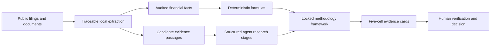

# CleanTech Finance

Evidence-first financial and bankability research for clean energy companies.

`cleantech-finance` turns annual reports and cited public comparators into fixed, five-cell financial evidence cards. It extracts a conservative set of audited facts, calculates reproducible metrics, applies a locked maintainer-authored framework, and exposes every unresolved judgment in a human review queue.

It does **not** produce an investment recommendation or an automated technology-readiness score.

## Why this exists

Generic research agents can summarize a company but often blur facts, calculations, and inference. Financial screeners calculate ratios but rarely explain whether a clean energy product can be manufactured, financed, permitted, insured, and adopted at the scale assumed by the model.

This project connects the two:



The deterministic core runs offline after documents are downloaded: zero model calls, zero API keys, and zero document uploads. The optional Agent Skill may research and prepare cited `judgment_context`; the local core imports, validates, calculates, and renders those stage outputs. A zero in `model_calls` describes the core run, not the preceding agent research.

See [the landscape review](docs/landscape.md) for the adjacent open-source projects considered and the gap this repository targets.

## What v0.2 actually delivers

Two dimensions are validated end to end:

- Profitability and unit economics
- Cash flow and funding gap

Each dimension produces one fixed card with exactly five cells:

1. cited subindustry and value-chain position;
2. extracted facts and deterministic calculations, each labeled and cited;
3. a locked, open-source-neutral methodology framework with an explicit comparison basis;
4. a red/amber/green **evidence signal** after applying that framework;
5. evidence gaps, required human judgment, and verification items.

The signal is never detached from its basis and gaps. There is no numeric score, weighted total, investment rating, credit rating, or aggregate risk rating.

From v0.2.1, formal cards present all five cell headings, the locked framework, signal meaning, review gaps, and disclaimer in English and Chinese. Numeric facts, page locators, source titles, and links stay in their original form.

## Honest capability inventory

Six financial retrieval lenses exist, but only the two listed above are validated and have implemented five-cell cards. The remaining four are `framework_ready_unvalidated`:

- Revenue, traction, and quality
- Profitability and unit economics
- Cash flow and funding runway
- Capital intensity and scale-up
- Balance sheet and funding dependency
- Project bankability

Commercialization evidence is organized under the 17 risk dimensions in the U.S. Department of Energy's [Adoption Readiness Levels framework](https://www.energy.gov/technologycommercialization/adoption-readiness-levels-arl-framework). All 17 are retrieval scaffolds, not validated judgment dimensions. The project does not copy the DOE questionnaire, calculate an ARL score, claim DOE endorsement, or replace the official assessment.

## Quick start

Python 3.10+ is required.

```bash
python -m venv .venv
# Windows: .venv\Scripts\activate
# macOS/Linux: source .venv/bin/activate
python -m pip install -e ".[pdf]"
```

The public examples use Sungrow as the subject and Enphase as an adjacent equipment reference, then reverse the roles for reproduction. Download both filings and run the ordered gate:

```bash
export SEC_USER_AGENT="Your Name your-email@example.com" # PowerShell: $env:SEC_USER_AGENT="..."
python scripts/run_release_gate.py
```

Open `outputs/release-gate/sungrow/report.html`. Each case also creates:

- `audit.json` - complete machine-readable provenance
- `report.md` - full portable audit
- `dimension_cards.json` - machine-readable five-cell cards
- `cards/*.html` and `cards/*.md` - one standalone artifact per dimension
- `evidence.csv` - one candidate passage per row
- `review_queue.csv` - missing or incomplete evidence to verify
- `financial_metrics.csv` - formulas and input-level citations

## Real-company validation

The 2025 Sungrow annual report test automatically recovered six audited facts, including net income. Selected facts are shown below:

| Fact | 2025 | Source location |
|---|---:|---|
| Revenue | CNY 89.184bn | Annual report, PDF p.135 |
| Operating cost | CNY 60.795bn | Annual report, PDF p.135 |
| Net income | CNY 13.533bn | Annual report, PDF p.136 |
| Net operating cash flow | CNY 16.918bn | Annual report, PDF p.139 |
| Cash paid for long-term assets | CNY 3.008bn | Annual report, PDF p.139 |
| Period-end cash equivalents | CNY 21.998bn | Annual report, PDF p.140 |

The deterministic layer then calculated 14.5% revenue growth, 31.8% gross margin, CNY 13.910bn free cash flow, and 3.4% capex-to-revenue. It did **not** calculate a cash runway because observed free cash flow was positive; instead it raised a human-review note covering future capex, working capital, commitments, and downside scenarios.

The same no-company-special-cases pipeline was then reproduced on Enphase Energy's 2025 Form 10-K. It correctly normalized three-year U.S. GAAP tables reported in thousands and accounting parentheses for capex outflows.

| Case | Extraction checks | Card-contract checks | Card signals | Result |
|---|---:|---:|---|---|
| Sungrow 2025 annual report | 29/29 | 27/27 | Profitability green; cash green | Pass |
| Enphase Energy 2025 Form 10-K | 28/28 | 27/27 | Profitability amber; cash amber | Pass |

The extraction checks validate facts, locators, formulas, citations, and guardrails. The card checks validate the five-cell contract, locked framework, relative-comparison method, cited application, three gap types, structured stage trace, and non-rating boundary. Neither number proves that an investment judgment is correct.

See [the evaluation protocol](docs/evaluation.md), [the Sungrow case](examples/sungrow/README.md), and [the Enphase case](examples/enphase/README.md).

## Use another company

Create a starter manifest:

```bash
cleantech-finance init manifest.json
```

Two input modes are supported:

1. **Anchored automatic extraction** for common English consolidated financial-statement labels. This currently extracts revenue, operating cost, net income, operating cash flow, cash paid for long-term assets, and period-end cash equivalents.
2. **Cited structured facts** for other report formats. Every number must contain a source id and page/line locator; the tool rejects uncited inputs.

Document evidence supports `.pdf`, `.html`, `.md`, `.txt`, `.csv`, and `.json`. PDF support is an optional install extra.

For a direct cross-company reproduction after both filings are present:

```bash
# macOS/Linux; SEC asks automated clients to identify themselves truthfully.
export SEC_USER_AGENT="Your Name your-email@example.com"
# PowerShell: $env:SEC_USER_AGENT="Your Name your-email@example.com"
python scripts/download_demo_sources.py enphase
cleantech-finance audit examples/enphase/manifest.auto.json \
  --only profitability-unit-economics cash-runway \
  --out outputs/enphase
python scripts/evaluate_audit.py outputs/enphase/audit.json evals/enphase-2025.json
python scripts/evaluate_cards.py outputs/enphase/audit.json evals/enphase-cards-v0.2.json

# Ordered final gate: full product on Sungrow, then Enphase; stops on failure.
python scripts/run_release_gate.py
```

## Trust model

- A retrieved passage is a **candidate**, not a verified conclusion.
- Evidence coverage is not a risk score. Missing public disclosure may create a gap even when underlying operations are sound.
- Company materials can support facts but remain interested-party sources.
- Calculations expose their formula and every cited input.
- Cross-company comparisons begin with business-model classification and the subject's own history. Adjacent-company observations are explicitly limited; no universal clean-energy margin threshold is used.
- `judgment_context` cannot override the locked methodology framework; validation fails if it tries.
- Automated `human_rating` fields must remain null; validation fails if software populates them.
- The tool prioritizes consolidated financial statements and excludes parent-company statement sections from consolidated evidence retrieval.

Read [methodology](docs/methodology.md) before using results in research.

## Repository layout

```text
src/cleantech_finance/   deterministic package and CLI
skills/                  Codex/Claude-style Agent Skill wrapper
schemas/                 manifest contract
examples/                public, reproducible company cases
evals/                   ground truth used by regression checks
tests/                   unit and integration tests
docs/                    method and evaluation notes
```

## Development

```bash
python -m pip install -e ".[pdf,dev]"
pytest
ruff check .
python scripts/evaluate_audit.py \
  outputs/sungrow/audit.json evals/sungrow-2025.json
python scripts/evaluate_audit.py \
  outputs/enphase/audit.json evals/enphase-2025.json
```

## Responsible use

This software provides research support only. It is not investment, accounting, legal, engineering, safety, or regulatory advice. Verify all cited pages and calculation boundaries before use.

## Authorship

Initial methodology and implementation: Cassian. Open-source contributions are attributed at repository level; individual evidence cards use a neutral locked-methodology statement rather than a personal signature.

## License

Apache-2.0. See [LICENSE](LICENSE) and [NOTICE](NOTICE).
