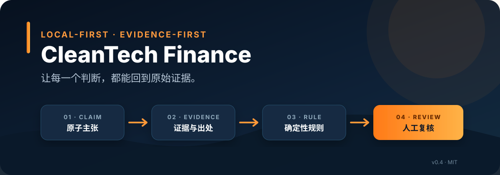
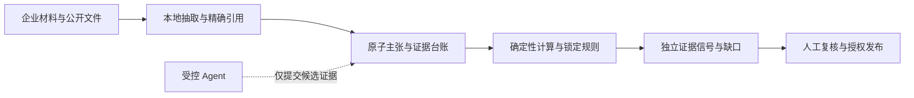
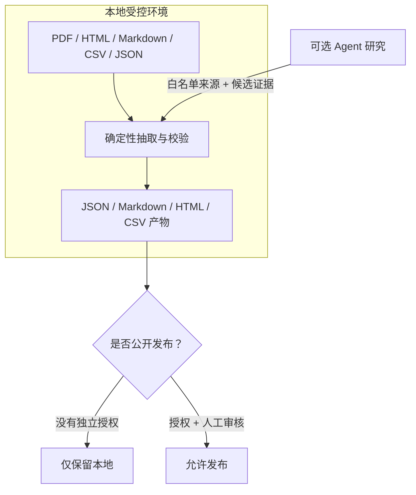
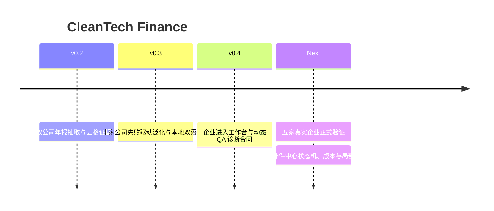

<div align="center">



# CleanTech Finance

### 从企业材料到可追溯判断：本地优先、证据优先、规则受控

[](pyproject.toml)
[](pyproject.toml)
[](tests)
[](README.md)
[](LICENSE)

**[English README](README.md) · [中文说明](README.zh-CN.md) · [完整状态报告](docs/CleanTech-Finance-project-status-review-2026-07-18.html) · [方法与边界](docs/methodology.md)**

</div>

---

## 一句话介绍

CleanTech Finance 是一个面向清洁技术企业尽调的本地工作台：它把年报、企业材料、人工访谈、公开资料和受控 Agent 结果组织成可追溯的**主张—证据—规则—人工复核**链条，再进入财务、商业化与企业补件流程。

它不是“替你下结论”的黑箱，而是“让每个结论都能被复核”的基础设施。

## 为什么值得关注

传统研究工具通常在两个极端之间摇摆：

- 自由文本总结很快，却容易混淆事实、计算和推断；
- 财务筛选器能算比率，却很少解释证据来自哪里、规则为什么触发、哪些判断仍需人工承担。

CleanTech Finance 把两者之间缺失的审计层补上：



> **核心原则：** Agent 可以发现候选证据，但不能覆盖规则、升级事实或替代人工授权。

## 现在真正可用的能力

| 模块 | 当前成熟度 | 已验证范围 | 明确不做 |
|---|---|---|---|
| 盈利／单位经济性 | **端到端已验证** | 年报抽取、计算、五格证据卡、引用与回归 | 不输出投资评级 |
| 现金流／资金缺口 | **端到端已验证** | 经营现金流、资本开支、自由现金流与证据缺口 | 不输出信用评级 |
| 其余四个财务维度 | 输入蓝图 | 字段与材料请求合同 | 尚无端到端判断卡 |
| 企业进入与访谈 | 已实现 | 阶段路由、双语访谈、分离授权、主张与证据台账 | 访谈原话不直接证明为真 |
| QA 动态诊断 | 工程合同已实现 | 动态追问、逐字段出处、重放校验、人工画像真值合同 | 真实五企正式批次尚未执行 |
| DOE ARL 17 维度 | 检索脚手架 | 维度级证据组织 | 不输出 ARL 1–9 分数 |
| ESG／影响／出海 | 证据框架 | 主张—证据与闸门 | 不是自动认证 |
| 企业补件中心 | 路线图 | 已有阶段化材料请求 | 尚无持久化状态机、企业端 UI 或 API |

## 已经被验证的部分

<table>
  <tr>
    <td align="center"><strong>155</strong><br/>完整测试</td>
    <td align="center"><strong>9 / 9</strong><br/>JSON Schema</td>
    <td align="center"><strong>29 / 29</strong><br/>Sungrow 抽取</td>
    <td align="center"><strong>28 / 28</strong><br/>Enphase 抽取</td>
    <td align="center"><strong>10 / 10</strong><br/>历史公司回归</td>
  </tr>
</table>

两个公开年报参考案例的正式卡片合同均为 **27/27**；确定性核心运行中的模型调用为 **0**。这证明抽取、页码、公式、引用和护栏通过了当前门禁，不证明任何投资判断必然正确。

本轮由人指定、配有独立画像真值并满足不可变哈希合同的真实企业验证仍为 **0/5**。这是当前进入下一阶段前最重要的未完成事项。

## 五格证据卡：不是一个分数，而是一条解释链

每个已验证财务维度都使用固定五格结构：

1. **企业处在什么子行业与价值链位置？**
2. **哪些事实来自文件，哪些指标由公式计算？**
3. **使用哪一条锁定方法论与比较基础？**
4. **规则为何触发红／黄／绿独立证据信号？**
5. **还缺什么证据，哪些判断必须交给人？**

红／黄／绿彼此独立，不加权、不汇总为总分，也不构成投资、信用或综合风险评级。

## 本地优先的数据边界



- 下载完成后，核心审计流程可离线运行；
- 不需要 API key，不上传企业文件；
- 授权、内部分析、公开内容、品牌、翻译和 AI 媒体许可相互分离；
- 私密企业材料不应进入 Git 仓库、公开 Issue 或可分享产物。

## 60 秒体验

```powershell
# Python 3.10+
python -m venv .venv
.\.venv\Scripts\Activate.ps1
python -m pip install -e ".[pdf]"

# 生成本地企业案例工作台
cleantech-finance case report `
  examples/company-intake/demo-distributed-solar/case.json `
  --out outputs/local-company-workbench-demo
```

打开：

```text
outputs/local-company-workbench-demo/workbench.html
```

完整公开年报发布门禁：

```powershell
$env:SEC_USER_AGENT="Your Name your-email@example.com"
python scripts/run_release_gate.py
```

## 项目适合谁

- 希望建立可复核清洁技术企业库的研究团队；
- 需要把创始人访谈与材料证据分开的产业机构；
- 需要确定性财务证据链，而非自由文本评级的分析人员；
- 想让 Agent 在可控边界内协助搜证，而不接管结论的团队；
- 正在设计企业补件、持续尽调或同行对照工作流的产品团队。

## 当前路线图



下一阶段的核心对象将围绕：

`gap_detected → request_drafted → request_sent → partially_submitted → submitted → needs_revision → accepted / rejected / waived`

设计重点包括字段、材料、证据等级、责任人、截止时间、提交版本、哈希、自动校验、人工审核、退回原因、不适用理由和局部重算范围。

## 公开承诺

CleanTech Finance 不输出投资建议、信用评级或综合风险评级；不把 Agent 输出自动升级为事实；不把企业访谈原话视作事实证明；不在缺少单独授权与人工审核时公开发布。

项目采用 [MIT License](LICENSE)。方法、限制、证据边界和验证协议均随代码公开，欢迎从可复现案例、负向测试和具体规则开始审查。

---

<div align="center">

### Evidence before judgment. 人在结论中，证据在结论前。

[开始使用](README.zh-CN.md#最小演示) · [阅读 QA 合同](docs/qa-diagnostic-loop.md) · [查看项目状态](docs/project-status-validation-receipt-2026-07-18.md) · [安全说明](SECURITY.md)

</div>
