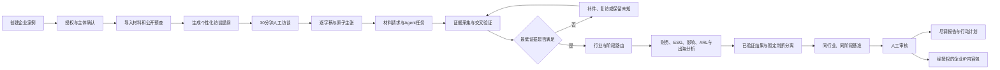

# CleanTech Finance v0.4｜Claude 技术交接与审核说明

## Technical Summary

当前版本是一个 **本地优先、证据优先的清洁技术企业尽调系统**，版本号为 `0.4.0`。它已经不再只是财务报告抽取工具：在 v0.3 的确定性财务内核上，v0.4 增加了企业入驻、人工访谈、材料请求、主张—证据管理、权限控制、五道闸门、评估路由和离线工作台。

需要准确区分三个成熟度：

1. **端到端已验证：** 盈利/单位经济性、现金流/资金缺口两项财务维度。
2. **当前可运行但仍需真实项目继续验证：** v0.4 企业入驻与证据工作台。
3. **仍是框架或下一阶段设计：** 完整 ESG、清洁技术影响、DOE ARL、出海准备度、企业补件中心、持久化应用和多用户系统。

v0.4 基线测试集合为 **75 项**；当前扩展工作树共 **357 项**，完整测试与 Ruff 均通过。这里的“通过”证明代码合约和既有回归未破坏，不代表投资结论、信用结论、ESG 保证或技术商业化判断已经被验证。

## 当前版本状态

- 项目版本：`0.4.0`
- 当前分支：`main`
- 基线提交：`350d497`
- 当前状态：v0.4 变更仍在本地工作树，尚未形成新的 Git 提交。
- 默认运行方式：本地文件、本地 CLI、本地静态 HTML；不要求上传企业材料。
- 核心语言：Python 3.10+。
- 对外定位：CleanTech Evidence OS / 清洁技术企业证据与尽调操作系统。

## 当前产品在做什么

一次企业项目按以下顺序运行：



核心原则是：**访谈产生陈述和主张，证据决定主张状态，人工决定证据接受与内容发布。**

## v0.4 已经实现的能力

### 1. 企业案例与阶段路由

`new_company_case()` 生成结构化本地案例。企业阶段支持：

- `research_and_development`
- `pilot`
- `early_commercial`
- `scaling`
- `mature`

不同阶段会产生不同的材料请求和访谈重点。

### 2. 分离的权限模型

案例分别记录：

- 录音与转写；
- 内部分析；
- 公开内容；
- 身份与品牌使用；
- 翻译与字幕；
- AI 合成媒体。

内部分析权限不自动等于公开发布权限。

### 3. 30 分钟人工访谈

系统生成中英双语访谈提纲，覆盖企业定位、发展阶段、创始人愿景、市场、产品、客户、经营与关键主张。访谈保持人工执行；模型用于组织问题和后续证据任务。

### 4. 主张与证据治理

信息在程序中按以下状态升级：

`原始记录 → 管理层陈述 → 原子主张 → 候选证据 → 事实状态 → 分析发现 → 批准发布`

证据等级为：

- `E0`：没有证据；
- `E1`：管理层陈述或 Agent 候选材料；
- `E2`：企业内部文件；
- `E3`：交易文件、官方记录或可核验外部材料；
- `E4`：独立验证或可靠多源确认。

关键主张默认至少要求 `E3`。主张状态支持：

- `verified`
- `partially_verified`
- `unverified`
- `conflicted`
- `refuted`
- `not_applicable`

访谈只能证明“某人说过什么”，不能直接证明说法为真。

### 5. 五道闸门

系统分别判断：

1. 授权闸门；
2. 主体与范围闸门；
3. 最低证据闸门；
4. 分析资格闸门；
5. 发布闸门。

资料不足时系统应该停在补件或人工研究状态，而不是产生一个看似完整的自动结论。

### 6. 可选本地 Agent 任务

系统可以生成白名单约束的取证任务。任务要求返回来源、获取时间、原始产物、哈希、实体匹配、字段和错误信息。

Agent 输出始终是候选证据：

- 不能自动升级为 `verified`；
- 不能绕过验证码；
- 不能覆盖规则、信号或应用路径；
- 不能直接修改最终评级或发布权限。

### 7. 同行业、同阶段比较边界

比较对象需要尽量保持相同子行业、阶段、商业模式、国家和期间。少于 5 个可比样本时不输出百分位，也不跨阶段生成综合排名。

### 8. 本地工作包

`case report` 当前能够生成：

- `case.json`
- `case_validation.json`
- `claim_ledger.csv`
- `evidence_ledger.csv`
- `content_release_register.csv`
- `interview_guide.md`
- `material_request.md`
- `agent_tasks.json`
- `benchmark.json`
- `assessment_plan.json`
- `intake_report.md`
- `intake_report.html`
- `workbench.html`

`workbench.html` 是无 CDN、无 `fetch()`、无外部上传的本地静态界面，可以编辑核心案例字段并下载更新后的 `case.json`。

## 既有财务内核的真实成熟度

当前只有两项财务维度经过端到端验证：

1. `profitability-unit-economics`
2. `cash-runway`

它们能够完成：

- 财务事实抽取；
- 单位与期间归一化；
- 确定性公式；
- 版本化规则；
- 中英双语五格证据卡；
- 引用、定位、输入摘要和规则摘要；
- 人工复核缺口。

另外四项财务维度只有输入合约蓝图，不能称为已实现或已验证。DOE ARL 的 17 个维度只有检索脚手架，当前不生成 ARL 1–9 分数，也不代表 DOE。

红/黄/绿只表示独立维度的财务证据信号，不进行加权或汇总，不构成投资、信用或综合风险评级。

## 验证与回归证据

- 当前测试集合：357 项（2026-08-03 本地完整门禁）。
- Ruff：通过。
- v0.4 入驻工作台测试覆盖：本地界面、权限、Agent 权限边界、公开发布条件、小样本比较和模块成熟度边界。
- v0.3 已完成十家新公司失败驱动循环。
- Sungrow 发布门禁：29/29 抽取/来源校验，27/27 五格卡合约校验。
- Enphase 发布门禁：28/28 抽取/来源校验，27/27 五格卡合约校验。
- 确定性财务核心在文件下载后运行：`model_calls = 0`，`network_calls = 0`。

这些结果验证的是抽取、来源、公式、规则边界和输出合约，不验证投资结论是否正确。

## 代码阅读地图

建议 Claude 按以下顺序阅读：

1. `README.md`：产品边界、成熟度和使用方式。
2. `src/cleantech_finance/onboarding.py`：案例对象、阶段、材料目录、证据等级、主张状态、五道闸门、访谈、Agent 任务、比较和评估路由。
3. `schemas/company-case.schema.json`：v0.4 案例输入合约。
4. `src/cleantech_finance/onboarding_reporting.py`：本地工作包和静态工作台生成。
5. `src/cleantech_finance/cli.py`：`case init/validate/report/agent-tasks` 命令入口。
6. `tests/test_onboarding.py`：v0.4 主要行为边界。
7. `src/cleantech_finance/audit.py`、`fact_extraction.py`、`rules.py`、`reporting.py`：既有确定性财务内核。
8. `scripts/run_release_gate.py` 与 `scripts/run_company_loop_registry.py`：发布与新公司回归门禁。
9. `docs/product-overview-brief.md`：面向产品读者的简洁流程和技术架构。

## 本地命令入口

```powershell
cleantech-finance case init case.json
cleantech-finance case validate case.json
cleantech-finance case report case.json --out outputs/company-intake
cleantech-finance case agent-tasks case.json
```

现有财务内核：

```powershell
cleantech-finance audit manifest.json `
  --only profitability-unit-economics cash-runway `
  --out outputs/company-audit
```

## 下一阶段已经确认、但尚未实现的设计

下一阶段重点是 **企业补件中心 / Counterparty Submission Center**。

目标状态机：

`gap_detected → request_drafted → request_sent → partially_submitted → submitted → needs_revision → accepted / rejected / waived`

每个补件任务需要保存：

- 对应主张、字段、闸门或分析维度；
- 缺失原因和影响；
- 必填字段、期间、单位与主体口径；
- 可接受的证据类型和最低证据等级；
- 企业责任人、截止时间和提交批次；
- 文件哈希、版本和变更差异；
- 自动校验结果、人工审核人和退回原因；
- `not_applicable` 理由与批准记录；
- 接受新证据后需要重新运行的主张、闸门和分析模块。

当前代码只生成阶段化材料请求，还没有补件中心的持久化状态机、企业端界面或 API。

## 已知限制和工程债务

1. 当前主要是 JSON/CSV/静态 HTML 工作包，不是持久化数据库应用。
2. 没有多用户登录、角色权限、审计数据库或企业门户。
3. 没有补件中心的 UI、API、通知、截止时间和版本差异实现。
4. 完整 ESG、影响、ARL、出海规则尚未完成真实企业级验证。
5. 其他四项财务维度仍不可执行。
6. 同业数据库尚未形成持久化、治理和匿名化机制。
7. 本地 Agent Bridge 已提供受控授权、只读案例/材料、RAG 查询以及政策/课程/导师资源读取与候选匹配接口；但仍没有通用外部任务执行器、持久化授权存储、回调协议或候选结果接纳工作流。
8. 政策更新器已经把网络与解析依赖纳入 `policy` extra，产品图依赖也已纳入 `docs` extra；但还没有定时调度、人工复核工作队列或把复核通过记录提升进参考库的持久化流程。
9. HTML 报告的标准打包与结构校验通过，但当前环境缺少打包器指定的 Chromium headless-shell，因此自动桌面/窄屏浏览器验证为 `structural_only`。
10. v0.4 当前仍是未提交的本地工作树，需要在正式发布前完成差异审查、版本提交和发布门禁。

## 希望 Claude 重点审核什么

请优先回答以下问题：

1. `company-case.schema.json` 是否足以演进到补件状态机，还是应该拆分 case、claim、evidence、submission、review 和 release 对象？
2. 当前 `validate_company_case()` 是否混合了过多职责；哪些规则应该拆成独立 gate/policy 模块？
3. 主张状态、证据等级和可见级别之间是否存在非法状态或权限绕过？
4. Agent 候选证据是否还有可能通过字段组合绕过人工接受边界？
5. `onboarding_reporting.py` 把领域逻辑、序列化和 HTML 生成放在一起是否会阻碍后续本地应用化？
6. 如何设计补件中心，使新材料只重算受影响的主张和模块，而不是全量重跑？
7. 在保持 local-first 的前提下，推荐的持久化层、加密、文件索引和审计日志边界是什么？
8. 哪些测试还缺失：冲突证据、撤销授权、材料版本替换、并发编辑、敏感材料、部分提交、Schema 迁移、失败恢复？
9. 当前项目结构中有哪些真实 bug、过度耦合、不可扩展接口或安全风险？
10. 从 v0.4 工作包走向可供内部团队直接使用的本地产品，最小工程路径是什么？

## 给 Claude 的审核输出要求

请不要只给通用架构建议。审核结果请按以下格式输出：

1. **当前系统的准确理解**：用不超过 10 条总结，不夸大成熟度。
2. **P0/P1/P2 问题列表**：每条引用具体文件和代码位置，说明触发条件与影响。
3. **证据和权限模型审核**：列出可被绕过、状态不完整或语义不清的地方。
4. **补件中心数据模型建议**：给出对象、关键字段、状态机和幂等/版本策略。
5. **最小重构方案**：优先小步重构，保持当前 357 项测试和发布门禁。
6. **新增测试清单**：区分单元、集成、属性/状态机与端到端测试。
7. **产品边界建议**：明确哪些能力可以宣传，哪些必须继续标记为框架或实验。

请保留以下约束：

- 不输出投资、信用或综合风险评级；
- 不把红/黄/绿汇总为总分；
- 不允许 Agent 覆盖确定性规则和信号；
- 不把管理层陈述直接当成事实；
- 不把 `authored`、`scaffold` 和 `validated` 混为一谈；
- 关键主张默认至少要求 E3；
- 公开发布必须单独授权并经过人工审核；
- 优先本地运行，API/Agent 只作为受控适配器。

## Caveats

本说明描述的是当前本地 v0.4 工作快照。Claude 在审核时应以实际工作树为准，并先运行测试与 Ruff，再判断任何重构建议。文档中的设计目标不代表对应工程已经完成。

## 2026-08-02 盲测与真实企业泛化补充

请在继续审核前完整阅读：

`docs/blind-generalization-validation-2026-08-02.md`

本轮新增或收紧了四个重要边界：

1. acquisition workflow 的材料身份、状态、覆盖来源和重复冲突现已失败关闭；三轮大型合成盲跑共 4,012 次调用。
2. Agent/RAG bridge 现在对白名单字段、事实权限、评级字段和任意嵌套层级的跨企业身份执行 fail-closed；第四轮独立 HTTP 黑盒全部通过。
3. Manifest 新增基于主体引用证据的 `applicability_context` v1.0.0；预商业化且未确认经营收入时，盈利维度可以由确定性政策输出 `not_yet_applicable`，但普通缺失收入仍然失败关闭，现金维度保持独立。
4. company-loop registry 已从 nullable `expected_signals` 迁移为逐维 `expected_outcomes`，明确区分 `evaluated`、`not_applicable` 和 `not_yet_applicable`，漏卡不能再被解释成 N/A。

QuantumScape 真实候选案例的自动审计已通过，最终候选产物位于 `outputs/company-loops/11-quantumscape/`。由于当前浏览器策略禁止直接打开本地 `file://` 报告，实际视觉检查尚未完成，所以它未进入最终 registry，也不能正式计为第 11 个完整公司循环。

当前自动门禁：357 项 pytest 通过、Ruff lint 通过、17 份示例 Manifest Schema 通过、Sungrow → Enphase 有序发布门禁通过、十家最终 registry 通过；确定性审计仍为 0 模型调用。

## 2026-08-03 资源中心、政策时效与 Agent 接口补充

继续审核前还应完整阅读：

- `docs/fa-resource-workflow-2026-08-02.md`
- `docs/resource-matching-blind-validation-2026-08-03.md`
- `src/cleantech_finance/policy_update.py`
- `src/cleantech_finance/enterprise_matching.py`
- `src/cleantech_finance/mentor_matching.py`
- `src/cleantech_finance/agent_bridge.py`
- `tests/test_policy_update.py`
- `tests/test_agent_bridge_resources.py`

本轮已经实现的真实范围：

1. `policy sync` 按受控来源清单抓取 20 个上海市政府或主管部门官方页面，保存原始响应、规范化记录、SHA-256、ETag/Last-Modified、状态和同步回执。20 个来源在 2026-08-03 的实测中均抓取成功。
2. 抓取结果进入独立 `candidate_pending_review` 更新流，不会自动改写已有的 73 条、经目录哈希确认的政策参考库，也不会自动认定企业申报资格。
3. 资源中心把政策、课程和导师统一为“目录 → 硬门槛 → 候选 → 人工确认 → 审计”流程，但三类资源保留不同的字段、权限和执行边界。
4. 增加 10 条模拟课程和 12 条模拟导师 fixture，用于在没有真实台账时验证匹配、失效、冲突、授权和展示流程。它们带有明确 `simulation_only` 合约；模拟导师不可联系，模拟课程不可自动报名。
5. Agent Bridge 新增 `resource:read` 和 `resource:match` scope，以及 `/api/agent/resources`、`/api/agent/resource-match` 接口。`resource:match` 在授权请求和人工批准阶段均强制依赖 `resource:read`。
6. 企业工作区会根据企业标签生成课程与导师候选，但不排序导师优劣、不自动联系/分配导师，也不自动报名课程。政策更新候选只在资源目录中展示，不进入严格资格匹配。
7. 前端增加 Resource Library 和企业工作区资源候选展示；本地浏览器已完成桌面和 390×844 窄屏检查，没有水平溢出，显式来源链接只允许 `http(s)`，占位文字不会再变成伪 localhost 链接。
8. 前端启动不再等待不可用 RAG 服务的 8 秒健康检查才渲染主页面；RAG 健康状态仍独立返回并明确显示不可用，不伪装成已连接。
9. 独立盲测以固定种子生成 3,200 组资源组合，完成 19,222 次公开接口调用和 39,604 次断言，0 失败；详细矩阵、哈希和局限见独立盲测记录。
10. OffDeal 只作为 AI-native 小型并购工作流的公开产品参照。该公司实际位于美国纽约、服务美国中小企业，不是巴西公司；本项目没有复制其专有代码或宣称功能等价。

当前可替换数据入口：

- 政策来源：`config/shanghai-policy-sources.json`
- 政策更新候选：`local-data/policy-updates/shanghai/candidate-feed.csv`
- 课程模板：`templates/course-catalog-template.csv`
- 导师模板：`templates/mentor-catalog-template.csv`
- 模拟资源：`examples/resource-catalog/`

本轮仍未实现：真实课程目录接入、真实导师授权与冲突台账、政策复核提升流程、统一数据库、团队账号/角色权限、补件中心状态机、真实企业端到端效用验证、自动部署和定时政策更新。FA 人员仍然负责交易策略、估值判断、谈判、法律/税务/监管判断、审批和外部沟通；系统只负责材料整理、确定性计算、缺口提示、候选建议和审计轨迹。

## 2026-08-03 Deal Execution Cockpit 与估值 P0 补充

继续审核前还应完整阅读：

- `docs/deal-execution-valuation-cockpit-p0-2026-08-03.md`
- `src/cleantech_finance/deal_service.py`
- `src/cleantech_finance/valuation.py`
- `src/cleantech_finance/valuation_workflow.py`
- `src/cleantech_finance/valuation_export.py`
- `tests/test_deal_service.py`
- `tests/test_valuation.py`
- `tests/test_valuation_workflow.py`
- `tests/test_agent_bridge_valuation.py`
- `tests/test_valuation_export.py`

本轮真实实现范围：

1. `deal_id` 与 `company_id / case_id` 分离，同一企业可以保存不同买方、交易范围、估值日和币种的交易。
2. Deal Store 保存人工确认阶段、任务、材料、问题、决策、估值案例、不可覆盖版本、哈希链、幂等键、乐观并发和 old/new/reason/actor/time 审计。
3. Agent 与浏览器不能提交计算结果。HTTP `calculate` 只接受版本与并发元数据，服务端从持久化输入调用确定性引擎。
4. 估值核心支持 EV-to-Equity、Trading Comps、FCFF DCF、Base/Downside/Upside、两类 WACC 敏感性、N/A/N/M、异常值和清洁技术适用性路由。
5. Candidate Input 必须经人工显式确认才能进入公式；金额、币种、单位、股数尺度和来源保留在输入记录中。
6. Calculation Integrity 与 Decision Readiness 分开；估值方法不汇总、不秘密加权，输出始终是 screen-grade。
7. 独立 Deals UI 支持交易、阶段、估值输入、计算、版本、复核、内部批准和 XLSX 导出。
8. 当前服务没有可验证个人身份。UI 采用固定本地 FA 身份断言，外部批准主动关闭；Agent Manifest 不含复核或批准工具。
9. XLSX 包含 Dashboard、Financials、Trading Comps、Precedents、DCF、Sensitivities、Sources & Assumptions、Checks 和 Versions，并明确标记 P0 未实现的方法。
10. 成熟盈利、亏损但有收入、项目型和未商业化业务均有失败驱动测试；项目型 NAV 与未商业化传统 DCF 在 P0 中 fail-closed。
11. 底层公开 `calculate_valuation` 不再接受调用方计算字典，只从指定不可变版本调用确定性引擎；伪造计算注入有回归测试。
12. 复核和批准版本会重新派生 Decision Readiness；硬失败、placeholder、计算完整性失败或 readiness blocker 会阻止内部批准。
13. 前端在失败重试期间复用幂等键；390px 移动端已验证无全页横向溢出，宽表只在局部滚动。
14. 幂等请求哈希同时绑定业务内容和预期 revision/version/hash；旧 key 不能在不同并发前提下误重放旧结果。
15. 财务输入合同可保存三年以上历史、一个 LTM、3–5 年预测、八项财务序列和四类口径；同期间多口径不会虚增覆盖，每个字段可保留独立来源。
16. 上市可比公司的 Equity Value / EV 可由股价、完全摊薄股数、现金、债务和其他桥接项确定性推导；不能与同一公司的直接 EV / Equity 输入混用。
17. HTTP 层会递归校验根来源和所有 `${field}_source` 的 workspace 归属；嵌套 artifact 不能绕过案例/材料校验。

仍未实现：Precedent Transactions 计算、项目级 DCF/NAV、Reverse DCF、收入增长×EBIT Margin 敏感性、浏览器中的完整财务合同可视化编辑器、真实团队身份与四眼审批、外部发布、数据库级多人并发、独立参考 Excel 金标对账和脱敏真实交易 shadow run。旧页面不提交完整财务合同时仍可做 screen-grade 计算，但必须保留 `financial_input_contract=not_provided` readiness warning。这些不得根据 P0 UI 或测试通过状态对外宣称为完成。
