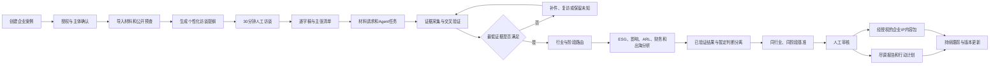
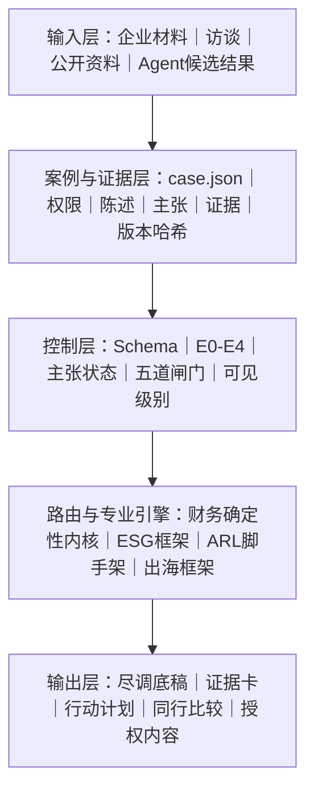

# CleanTech Evidence OS｜产品简介

## 它是什么

一套本地优先的清洁技术企业证据与尽调操作系统。

企业进入系统后，我们把企业材料、30 分钟人工访谈、公开资料和受控 Agent 结果整理为可追溯的主张—证据链，识别缺失信息，生成补件与取证任务，再按行业和企业阶段进入财务、ESG、清洁技术影响、ARL 与出海分析。

系统不把“说过的话”直接当成事实，也不把 Agent 结果直接当成结论。最终由人工审核形成尽调报告、行动计划，以及经过单独授权的企业 IP 内容包。

## 完整业务流程

## 技术架构

## 真实能力边界

| 当前已经具备 | 下一阶段重点设计 | 明确不能宣称 |
|---|---|---|
| 本地企业案例、授权、访谈、材料、主张、证据和五道闸门 | 企业补件中心：提交、退回、接受、版本差异和局部重算 | 自动 ESG 认证、自动 ARL 分数或综合投资评级 |
| 白名单 Agent 任务与候选证据边界 | 企业端提交界面、字段校验、敏感材料权限 | Agent 结果自动成为事实 |
| 两项已验证财务证据分析 | 更多规则的真实企业验证 | 跨阶段强行比较或少样本百分位 |

当前端到端验证范围只有：

1. 盈利与单位经济性；
2. 现金流与资金缺口。

另外四个财务维度只有输入蓝图；17 个 DOE ARL 维度仍是检索脚手架。完整 ESG、ARL 和出海分析目前属于证据框架，不是自动认证或评分。
