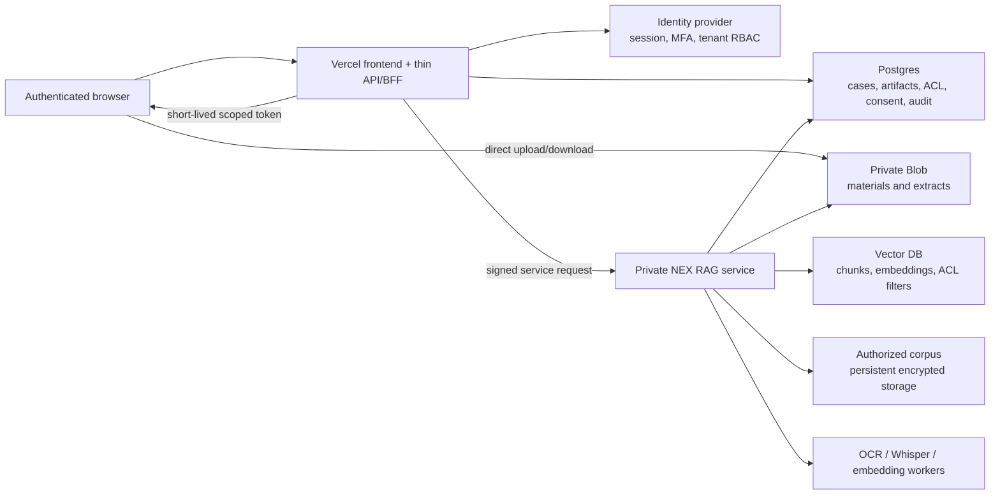

# CleanTech Finance：Vercel 部署适配评估

> 评估状态：架构与部署前评估，**尚未部署**
> 基准日：2026-08-02
> 评估对象：CleanTech Finance 源码、loopback Bridge、本地 case workspace，以及独立的 `D:\NEX_企业知识库` RAG 运行时
> 结论等级：**No-Go for lift-and-shift；Go for re-architected thin web tier**

## 1. 执行结论

CleanTech Finance 的源码体积可以上传到 Vercel，但完整产品不能原样、安全地部署到 Vercel。

使用下列命令得到的可部署源基线为 **155 个文件、2,448,303 bytes（2.33 MiB）**，明显低于 Vercel CLI source upload 的 Hobby 100 MB、Pro 1 GB 和 15,000 source files 限制：

```powershell
git -c core.quotepath=false ls-files --cached --others --exclude-standard
```

真正的阻断不是前端源码，而是运行架构：

- `src/cleantech_finance/agent_bridge.py` 使用 Python `ThreadingHTTPServer`，强制绑定 IPv4 loopback 或 `localhost`，并只允许同源 loopback UI 写请求；
- `CaseWorkspaceStore` 将 case 材料、抽取文本和 `workspace.json` 持久化到本地目录；
- 当前浏览器上传合同允许单案合计 **32 MB**，高于 Vercel Function **4.5 MB** 请求 body 上限；
- consent token 和 authorization request 当前是本机进程内、短期、case-scoped 的本地授权机制，不是互联网应用身份认证系统；
- 独立 `D:\NEX_企业知识库` RAG 运行时包含约 **4.18 GB SQLite、11.828 GB/60,635 files 语料、897.7 MB embeddings、599.6 MB Whisper**，不能打入标准 Vercel Python Function，也不能依赖 Function 临时文件系统运行；
- Bridge 默认通过未认证的 loopback HTTP 调用本机 RAG，该信任边界不能直接改成公网 URL。

推荐目标架构是：**Vercel 前端 + thin API + 正式 Auth + Private Blob + Postgres + vector DB + private RAG service**。Vercel 负责展示、身份会话、轻量授权编排和小型响应；材料、业务状态、向量和重计算全部外置。本文不表示已创建 Vercel 项目、上传数据、配置域名或完成生产部署。

## 2. 本项目实测基线

以下数字为项目团队截至 2026-08-02 的测量。数据资产可能相互派生，不能简单相加后宣称总存储需求。

| 资产 | 已测量规模 | 解释 | 判断 |
|---|---:|---|---|
| Repository 工作目录 | 148.96 MB，包含 ignored/output | 不是 Vercel 实际 source upload 口径 | 不能据此判断上传失败；ignored/output 不应进入部署源 |
| 当前可部署源 | 155 files、2,448,303 bytes（2.33 MiB） | 约为 Hobby 100 MB 上限的 2.33%，文件数约为 15,000 上限的 1.03% | 源码体积和文件数不是阻断项 |
| NEX RAG SQLite | 4.18 GB | 独立本地 RAG 的索引/状态资产 | 不能进入标准 Function bundle 或 `/tmp`；需迁移或由 private RAG 持有 |
| NEX 私有语料 | 11.828 GB、60,635 files | 位于独立本地知识库，不属于部署源 | 必须与应用源码隔离；是否上云需单独授权与数据审查 |
| Embeddings | 约 897.7 MB | RAG 派生向量资产 | 单项超过标准 Python 500 MB bundle；应进入 vector DB 或 RAG 持久存储 |
| Whisper | 约 599.6 MB | 本地语音模型资产 | 单项超过标准 Python 500 MB bundle；应由独立 worker/模型服务运行 |

### 2.1 必须保持的口径

- `source_size` 只描述 Git 可部署源，不包括独立 RAG、私有语料、ignored/output 或运行时数据。
- `function_bundle_size` 必须以生产构建后的单个 Function 未压缩包实测，不能由 2.33 MiB source 推断。
- `workspace_storage`、`rag_storage`、`blob_storage` 和 `vector_storage` 必须分别计量。
- 任何迁移完成率都不能仅按文件数量计算；还需校验 SHA-256、case/tenant 权限、版本、引用和删除状态。

## 3. 当前 CleanTech Finance 运行边界

### 3.1 Loopback Bridge

当前 `agent_bridge.py` 的安全设计是本地边界，不是通用 Web 服务：

- `create_agent_bridge_server()` 使用 `ThreadingHTTPServer`；
- `_validate_loopback_host()` 拒绝非 IPv4 loopback/`localhost` 监听地址；
- `_validate_loopback_url()` 要求 RAG URL 为无用户名密码的本地 HTTP loopback URL；
- UI mutation 要求显式同源 `Origin`，非同源或缺失 Origin 的写操作被拒绝；
- 默认 Bridge 为 `http://127.0.0.1:8765/`，默认 RAG 为 `http://127.0.0.1:8000`。

因此不能通过把 host 改成 `0.0.0.0` 或简单包装成一个 Vercel Function 来完成生产云部署。那会绕过项目现有的本地信任假设。

### 3.2 `CaseWorkspaceStore` 本地持久化

`src/cleantech_finance/workspace_service.py` 当前将每个 case 保存为本地目录：

```text
case-YYYYMMDD-xxxxxxxxxx/
├── materials/       原始上传材料
├── extracts/        本地抽取文本
└── workspace.json   case、artifact、SHA-256、版本、候选角色和边界
```

写入过程使用临时目录、进程内写锁和 `os.replace()` 实现单机原子切换；读取和 dashboard 通过本地目录枚举完成。这依赖可持久写入的共享文件系统和单机一致性假设。Vercel Function 的本地文件系统不能承载该生产状态。

### 3.3 上传合同

当前代码约束为：

| 项目合同 | 当前值 |
|---|---:|
| 单案最多文件数 | 20 |
| 单文件最大值 | 20 MB |
| 单案文件合计最大值 | 32 MB |
| Bridge multipart request 上限 | 32 MB + 1 MB envelope |
| 允许类型 | CSV、DOCX、HTML、JSON、Markdown、PDF、PPTX、TXT、XLSX |

Vercel Function 的请求或响应 body 上限为 4.5 MB，因此当前 32 MB multipart 上传不能经过 thin API。云端必须改为“先认证授权、再向 Private Blob 直传、最后提交小型 manifest”的三段式协议。

### 3.4 本地授权不是云端登录

当前授权有明确且应保留的业务语义：

- `ConsentRegistry` 签发短期 Bearer token，默认 TTL 30 分钟；
- token 绑定 actor、scope，读取 case/material/RAG 时还绑定 `case_id`；
- 支持撤销、到期和 token fingerprint 审计，不记录明文 token；
- Agent authorization request 默认 TTL 5 分钟，需人在 UI 中确认 actor、purpose、case 和 scopes；
- request secret 与 UI 分离，获批请求只能交换一次；
- `case:read`、`material:read`、`rag:query` 等 scope 仅授予候选材料/参考结果访问，不授予证据核验、投资结论、公开发布或代替人工审批的权限。

这些机制是应用内 consent/authorization，不证明互联网用户身份，也不提供跨实例 session、账户恢复、MFA、组织成员管理或持久撤销。云端必须在其外层增加正式 Auth 和 tenant/case RBAC，不能把现有内存 token 当作登录系统。

### 3.5 独立 NEX RAG

`D:\NEX_企业知识库` 是独立于 CleanTech Finance 源码的本地服务和数据边界。当前 Bridge 只把 RAG 结果当作候选参考，不能让 RAG 结果覆盖 deterministic core、证据核验或人类决定。

Vercel 无法直接访问本机 `D:` 盘或 `127.0.0.1:8000`。如需云端调用，必须把 RAG 部署成受保护的 private service，或建立经明确授权的安全网关；不能把本机未认证 HTTP 端点暴露到公网。

## 4. Vercel 官方约束与影响

| 约束 | 官方现行说明 | 对 CleanTech Finance 的影响 |
|---|---|---|
| CLI source upload | Hobby 100 MB，Pro 1 GB；source files 最多 15,000 个 | 当前 2.33 MiB/155 files 明显通过；独立语料和模型不得加入 source |
| Python Function bundle | 标准 Python Function 最大未压缩 bundle 500 MB；构建时可达文件可能被包含，需主动排除 | 源码虽小，仍须实测依赖；4.18 GB SQLite、embeddings、Whisper 和语料不得打包 |
| Function body | 请求 body 或响应 body 最大 4.5 MB | 现有 32 MB multipart 上传不能穿过 Function；大文件必须直传对象存储 |
| 文件系统 | Function 文件系统只读，仅 `/tmp` 可写，scratch space 最多 500 MB，不能作为跨 invocation 持久状态 | `CaseWorkspaceStore` 不能原样运行；case、artifact、consent 和 audit 必须迁至外部持久层 |
| Blob | 支持 private/public 对象；大于 4.5 MB 可从浏览器直接上传并通过服务端交换上传令牌 | 适合 case materials/extracts；不适合作为关系数据库、授权账本或运行中 SQLite |
| Marketplace storage | 可接入 Postgres、KV、NoSQL 和 vector database | case/权限/审计进入 Postgres；embedding 进入 vector DB |

官方依据：

- [Vercel Limits](https://vercel.com/docs/limits)，Vercel，更新于 2026-02-03：Hobby 100 MB、Pro 1 GB、15,000 source files 等限制。
- [Using the Python Runtime with Vercel Functions](https://vercel.com/docs/functions/runtimes/python)，Vercel：标准 Python Function 500 MB 未压缩 bundle 和 `excludeFiles`。
- [Vercel Functions Limits](https://vercel.com/docs/functions/limitations)，Vercel：Function 请求或响应 body 最大 4.5 MB。
- [Vercel Runtimes](https://vercel.com/docs/functions/runtimes)，Vercel：只读文件系统和最多 500 MB `/tmp` scratch space。
- [Vercel Blob](https://vercel.com/docs/vercel-blob)，Vercel，更新于 2026-01-21：private/public 对象存储及大文件用途。
- [Client Uploads with Vercel Blob](https://vercel.com/docs/vercel-blob/client-upload)，Vercel，更新于 2025-09-17：大于 4.5 MB 文件从浏览器直传，并由服务端交换令牌。
- [Vercel Storage Overview](https://vercel.com/docs/storage)，Vercel，更新于 2026-01-24：Blob 及 Marketplace 的 Postgres、KV、NoSQL 和 vector database 选项。
- [Postgres on Vercel](https://vercel.com/docs/postgres)，Vercel，更新于 2025-07-22：新项目通过 Marketplace 接入外部 Postgres 提供商。

## 5. Lift-and-shift 适配判断

| 当前组件 | 能否原样上 Vercel | 原因 | 目标处理 |
|---|---|---|---|
| Web workbench 静态资产 | 部分可以 | 静态 HTML/CSS/JS 体积小，但当前 API 和身份假设是本地模式 | 作为 Vercel 前端，改接正式 Auth 和 thin API |
| `ThreadingHTTPServer` Bridge | 不可以 | 强制 loopback、进程内状态、同源本地信任边界 | 拆为无状态 API/BFF；本地 Bridge 继续作为 desktop/local 模式 |
| `CaseWorkspaceStore` | 不可以 | 本地目录、文件锁、原子 rename 和目录枚举不能跨 Function 实例持久化 | Blob 存对象，Postgres 存 case/artifact/版本/状态 |
| 32 MB multipart 上传 | 不可以 | 超过 4.5 MB Function body | 浏览器直传 Private Blob，API 只签发 token 和接收 manifest |
| `ConsentRegistry` 内存状态 | 不可以 | 实例重建或并发会丢失/分裂授权状态；且没有用户身份 | Auth + Postgres 持久 grant/revocation；保留 scope/case/TTL 语义 |
| 本地 RAG loopback 客户端 | 不可以 | Vercel 的 loopback 指向 Function 自身，不是 `D:` 盘机器 | private RAG HTTPS/service channel + 服务身份和最小权限 |
| Deterministic core | 条件可行 | 若依赖和执行时间满足 Function 限制，可作为纯计算；不得隐式读取本地文件 | 无状态输入输出、版本固定、审计结果外存；构建后实测 |
| NEX SQLite/语料/模型 | 不可以 | 体积、持久性、计算和隐私均不适合 Function bundle | Postgres/vector DB/对象存储/private RAG 分层持有 |

## 6. 推荐目标架构



### 6.1 Vercel 前端与 thin API

只承担：

- Workbench 页面、case 列表、材料状态、授权确认和候选结果展示；
- 登录回调、session 校验、CSRF、输入验证、速率限制和 tenant/case 权限检查；
- 生成短时、限路径、限 MIME、限大小的 Blob upload token；
- 写入小型 case/artifact manifest；
- 调用 deterministic core 的轻量纯计算接口；
- 用服务身份调用 private RAG，并返回分页、带引用的小响应。

不得承担：原始大文件代理、长期本地状态、SQLite 并发写入、全量语料扫描、OCR/Whisper/embedding 或批量建索引。

### 6.2 Auth 与 consent

建议分成两层：

1. **Identity/Auth**：确认用户和组织身份，提供 session、MFA、成员生命周期和 tenant RBAC；
2. **Case consent**：沿用现有 actor、purpose、scope、case binding、TTL、human review、一次交换和撤销语义。

Postgres 只保存 grant/request 状态、token hash/fingerprint、到期、撤销、审批人和审计事件；明文 token 不落库。任何 `case:read`、`material:read`、`rag:query` 请求同时通过用户身份、tenant、case ACL 和 consent scope 四层检查。

### 6.3 Blob 与 32 MB 上传

推荐协议：

1. 用户登录后向 thin API 提交文件名、大小、类型、case 及 SHA-256 候选值；
2. API 验证单文件 20 MB、最多 20 个文件、合计 32 MB 及允许后缀；
3. API 签发短期、case-scoped 的 Private Blob client upload token；
4. 浏览器直接上传，不经过 Vercel Function 4.5 MB body；
5. 上传完成回调写入 Postgres，初始状态为 `uploaded_unverified`；
6. worker 重算 SHA-256、扫描和抽取，成功后写入 immutable object/version；
7. case manifest 只有在全部预期对象验证后才原子转为 `candidate_ready`。

Blob object key 应包含不可猜测 tenant/case/artifact/version 标识，但授权不能只依赖路径不可猜测。默认 private；不得将企业材料放入 public Blob。

### 6.4 Postgres 替代本地 workspace 状态

至少需要：

- `tenants`、`users`、`memberships`、`cases`；
- `artifacts`、`artifact_versions`、`object_refs`、`extracts`；
- `authorization_requests`、`consent_grants`、`revocations`；
- `jobs`、`audit_events`、`rag_queries`、`citations`；
- case revision、SHA-256、authority、human-review 和 public-release 边界。

必须用数据库事务/乐观锁替代本地进程锁和目录 rename；`workspace.json` 可以生成兼容投影，但不再是云端唯一主账本。

### 6.5 Vector DB 与 private RAG

- vector DB 保存 chunk/vector、embedding model/version、document/artifact ID、tenant/case ACL、时间和删除 tombstone；
- private RAG 负责解析、OCR、Whisper、embedding、增量索引、混合检索、rerank 和引用定位；
- 4.18 GB SQLite 仅作为迁移源或 private RAG 内部资产，不能作为 Vercel 生产文件；
- 11.828 GB/60,635 files 语料必须先按所有者、namespace、敏感性、授权和驻留分类，禁止无差别全量上云；
- Vercel 到 RAG 使用 TLS、短期服务身份、请求签名或 mTLS、网络 allowlist、速率限制和审计；
- RAG 结果继续标记为 candidate/reference suggestion，不能覆盖 deterministic core 或人类审批。

## 7. 本地模式与云端模式的产品边界

建议保留两个显式模式，而不是悄悄改变安全语义：

| 模式 | 运行位置 | 数据 | 授权 | RAG |
|---|---|---|---|---|
| `local_bridge` | 用户本机 loopback | 本地 case workspace | 当前短期 consent + 同源本地 UI | 本机 loopback NEX gateway |
| `hosted_thin` | Vercel + 外部持久层 | 经授权上云的 Blob/Postgres 数据 | 正式 Auth + tenant/case RBAC + consent | private service，服务身份调用 |

云端模式不得默认读取本机 case、`D:` 盘语料或本地 token。两种模式间同步必须是显式、可撤销、可审计的用户操作，并记录对象 hash、来源、授权、时间和删除传播状态。

## 8. 安全与人工权限边界

- Preview、Development、Production 使用隔离的 Auth client、Postgres、Blob、vector index 和 RAG service credentials。
- 企业材料默认 private；上传令牌生成前必须完成用户、tenant、case、类型和大小授权。
- UI 隐藏按钮不构成授权；每个 API 和 RAG 调用在服务端重复验证。
- case/material/RAG scope 不授予证据核验、政策资格认定、投资/授信结论、公开发布、交易报价、签约或交割权限。
- Agent 产出继续标为候选；材料准备度不代表事实已验证或真实交易进度。
- 所有引用必须回溯到 artifact/version/hash 和精确定位；RAG 相似度不能代替来源权威。
- 删除需覆盖 Blob、Postgres、vector、缓存、派生文本和适用备份，并保留可审计 tombstone。
- 不把 `.env`、密钥、token、企业原文、私有目录、SQLite 或模型加入 Git source。
- 上云前完成数据所有权、隐私、跨境、驻留、保留、供应商和事件响应审查。

## 9. 分阶段路线

### Phase 0：部署清单和架构冻结

- 固化 155 files/2,448,303 bytes（2.33 MiB）source manifest；
- 生产构建实测每个 Function bundle 和依赖追踪；
- 明确本地模式、云端模式和 private RAG 的网络/数据边界；
- 对所有拟迁移 case/语料建立 allowlist、所有者、权限和驻留决定；
- 执行 secret、私有材料、SQLite、模型和 output 排除检查。

**退出条件**：源码清单持续低于平台限制；无私有数据进入部署源；目标架构和迁移范围获授权。

### Phase 1：合成数据的 Vercel 薄前端

- 部署 Workbench UI、健康检查和正式 Auth；
- 使用合成或公开样例，不连接生产 case 或 NEX RAG；
- 验证 session、CSRF、RBAC、Preview 隔离、日志和回滚。

**退出条件**：身份与环境隔离测试通过；仍准确标记为 prototype/preview，不声称完整产品已部署。

### Phase 2：Private Blob + Postgres workspace

- 实现 case/artifact schema、授权请求、consent、审计和状态机；
- 实现 32 MB 合同下的浏览器直传、服务端 SHA-256 重算和扫描；
- 用小规模、明确授权数据验证本地 `workspace.json` 与云端投影的一致性。

**退出条件**：大于 4.5 MB 的材料不经过 Function body；权限、删除、版本和失败恢复测试通过。

### Phase 3：Vector DB + private RAG

- 将解析、OCR、Whisper、embedding 和索引部署到 private worker；
- 建立 Vercel-to-RAG 服务身份、限流、审计和失败隔离；
- 导入有限授权 corpus，验证 case ACL、引用、召回、延迟和成本；
- 保持 RAG candidate-only authority。

**退出条件**：跨 tenant/case 隔离、引用准确性、重建、撤销传播、恢复和 SLO 通过。

### Phase 4：受控迁移与生产切换

- 以 4.18 GB SQLite 为迁移源时先冻结窗口、导出、去重和对账；
- 按 namespace/case 分批迁移，双读核对对象数、hash、版本、ACL、引用和 tombstone；
- 保留本地模式和回滚路径；
- 完成安全、隐私、灾备、成本和业务所有者验收。

**退出条件**：相应环境的部署、数据完整性和安全证据齐全后，才允许称为“已部署/已迁移”。

## 10. 上线前强制验收门

| Gate | 通过标准 | 证据 |
|---|---|---|
| Source | 当前基线 155 files/2.33 MiB；持续低于计划上限且不引入数据/模型 | manifest、字节汇总、部署日志 |
| Function bundle | 每个标准 Python Function 未压缩 bundle < 500 MB，并保留增长余量 | 生产构建报告、依赖清单 |
| Upload | 20 files/20 MB each/32 MB total 合同由服务端复核；大文件直传，不经过 4.5 MB body | E2E、413、类型/大小/重复/中断测试 |
| Persistence | case、artifact、consent 和 audit 不依赖 Function 本地文件或内存 | schema、事务、冷启动和并发测试 |
| Auth | 身份、tenant、case ACL、scope、TTL、撤销和 human approval 全部服务端验证 | 权限矩阵、越权测试、审计日志 |
| Blob | 企业材料 private；token 短期、限路径/类型/大小；下载也需授权 | 配置、token 测试、公开访问拒绝 |
| RAG | private service 有强认证；tenant/case ACL 生效；candidate-only authority 保持 | 网络图、服务身份、隔离/引用测试 |
| Migration | 对象、hash、版本、ACL、引用和删除状态对账 | 迁移报告、抽样和回滚演练 |
| Privacy | 仅获授权数据上云；无密钥、SQLite、模型或企业原文进入 source | 数据清单、DLP/secret scan、批准记录 |
| Operations | 监控、告警、成本预算、备份恢复、保留删除和事件响应可执行 | runbook、演练、SLO/预算 |

任一强制门未通过，状态保持 `not_ready_for_production`。前端能打开、源码能上传或 Vercel 构建成功，都不能单独证明完整 CleanTech Finance 已安全部署。

## 11. 准确表述

当前可以表述为：

> 已完成 CleanTech Finance 的 Vercel 部署适配评估。155 files/2.33 MiB 的可部署源码本身没有超过 Vercel source 限制；但 loopback Bridge、`CaseWorkspaceStore` 本地持久化、32 MB 上传合同、本地授权，以及独立 NEX RAG 的 SQLite、语料、embedding 和语音模型不能原样进入 Vercel。推荐采用 Vercel 前端 + thin API + Auth + Private Blob + Postgres + vector DB + private RAG 的分层架构。尚未执行生产部署。

在没有对应证据前，不得声称完整产品、私有语料、4.18 GB SQLite 或模型已部署/迁移，也不得把源码上传成功等同于生产安全就绪。
